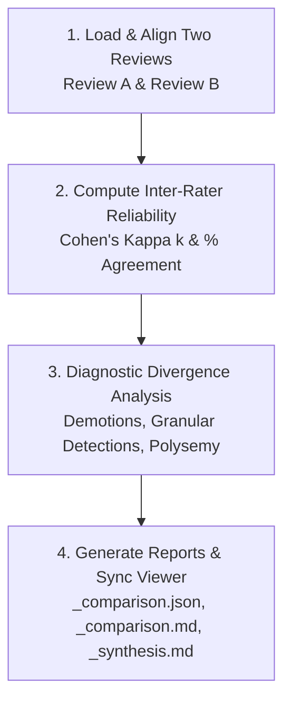

# Skill: compare-literature-reviews

## Purpose & Responsibility
Evaluate the agreement, consistency, and divergences between any two saved literature reviews in `workspace/reviews/`. This skill operates on existing review files (such as a sealed Human Baseline vs an Agentic Review, two independent reviewer runs, or iterative prompt versions). It computes rigorous statistical reliability metrics (Cohen's Kappa $\kappa$, Percent Agreement) and provides diagnostic qualitative analysis of discrepancies.

> [!NOTE]
> **Strict Separation of Concerns**: This skill does NOT ingest external raw files or re-run paper prose evaluations. It operates strictly on two completed review files in `workspace/reviews/`.

---

## The 4-Step Comparison Lifecycle



### Step 1: Load & Align Two Reviews
- **Input Parameters**:
  - `review_a_id`: Path or ID of first review (e.g. `rev_williams2026_baseline`).
  - `review_b_id`: Path or ID of second review (e.g. `rev_agentic_williams_codesign_comparison`).
  - `target_column_a`: Column to compare in Review A (e.g. `human_highest_activity`).
  - `target_column_b`: Column to compare in Review B (e.g. `agentic_highest_activity`).
- **Paper Alignment**:
  - Match records by `paper_id` (or DOI / normalized title).
  - Identify intersection of papers present in both reviews.
  - Flag any papers present in only one review as unaligned.

### Step 2: Compute Inter-Rater Reliability Statistics
Execute deterministic Python computation of inter-rater reliability:

1. **Overall Multiclass Agreement**:
   - Percent Agreement:
     $$\text{Percent Agreement} = \frac{\text{Agreed Papers}}{\text{Total Common Papers}} \times 100$$
   - Multiclass Cohen's Kappa ($\kappa$):
     $$\kappa = \frac{P_o - P_e}{1 - P_e}$$
     where $P_o$ is observed relative agreement and $P_e$ is hypothetical chance agreement.

2. **Category-by-Category Binary Metrics**:
   For each distinct category in the codebook:
   - Binary Percent Agreement
   - Binary Cohen's Kappa ($\kappa$)
   - Sensitivity (Positive Agreement)
   - Specificity (Negative Agreement)

3. **Standard Interpretation Scale (Landis & Koch, 1977)**:
   - $\kappa > 0.80$: Almost Perfect / Excellent Agreement
   - $0.61 \le \kappa \le 0.80$: Substantial Agreement
   - $0.41 \le \kappa \le 0.60$: Moderate Agreement
   - $\kappa < 0.40$: Fair / Slight Agreement

### Step 3: Diagnostic Divergence Analysis
Systematically categorize every mismatched paper into standard research divergence categories:

1. **Attribution Demotions**:
   - Situations where Review A (e.g. human rater) credited an action based on inferred partnership, but Review B (agentic review) demoted it to `Unclear` or `None` because the paper text only used passive voice or collective "we" without attributing agency to the target actor.
2. **Granular Detections**:
   - Situations where Review B detected authentic, concrete evidence deeply embedded in results or discussion sections that was overlooked during Review A's broader screening sweep.
3. **Polysemy Checks**:
   - Situations where identical surface vocabulary had different meanings (e.g. "teachers were selected for the study" [administrative sampling] vs "teachers selected curriculum modules" [design choice]). Confirm zero false positives.
4. **External / Non-Repository Papers**:
   - Papers external to `proceedings.db` that were intentionally excluded from LLM evaluation.

### Step 4: Deliverables & Web Viewer Synchronization

1. **Comparison Review Data Table**:
   - Save to `workspace/reviews/<review_id>_comparison.json` and `<review_id>_comparison.md`.
   - Side-by-side columns:
     - Bibliographic columns: `Authors ◈`, `Title ◈`, `Year ◈`, `Venue ◈`, `DOI ◈`.
     - Review A code and notes.
     - Review B code, evidence quote, and evidence taxonomy status.
     - Comparison verdict: `Agreement`, `Attribution Demotion`, `Granular Detection`, or `External / Non-Repository`.

2. **Comparative Synthesis Report**:
   - Save to `workspace/reviews/<review_id>_comparison_synthesis.md`.
   - Sections:
     - **Execution Method Badge**: Standardized badges for method, text coverage, and epistemic standard.
     - **Executive Abstract**: High-level findings and overall reliability summary.
     - **Inter-Rater Reliability Table**: Complete multiclass and category-by-category metrics.
     - **Divergence Breakdown**: Narrative discussion of specific divergent papers with verbatim quotes.
     - **Epistemic Implications**: Recommendations for refining coding schemes or review criteria.

3. **Rebuild Web Viewer Cache**:
   ```bash
   python3 scripts/build_all_reviews_cache.py
   ```
   Verify server responds on port 8888 (`curl -sI "http://localhost:8888/viewer?review=<review_id>_comparison"`).

---

## Epistemic Standard & Sigils
Always label tables and synthesis reports with the repository sigil key:
`Source: ◈ Database Record / Ground Truth | ◇ Derived Metric | ⌕ Verbatim Section Evidence | ✦ Agent-Synthesized Coding`.
