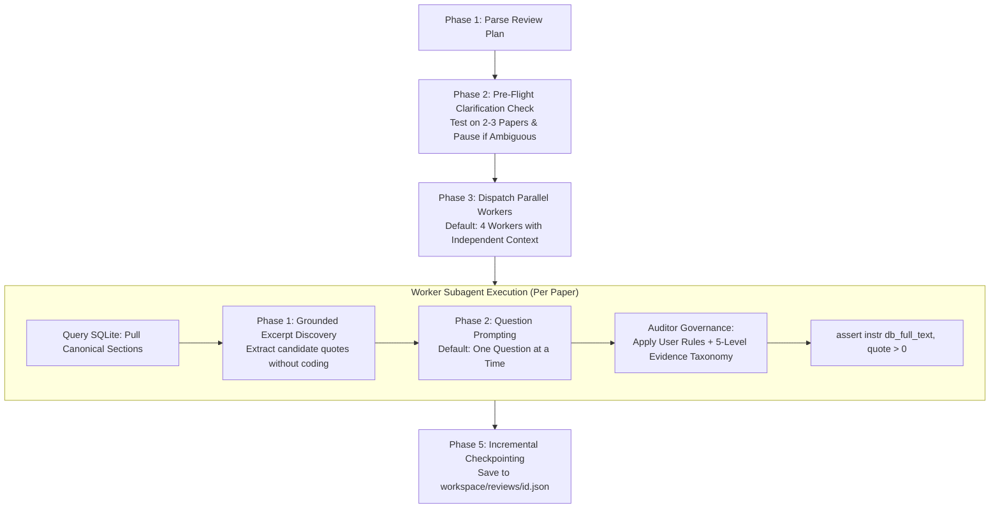

# Skill: execute-agentic-review

## Purpose & Responsibility
Conduct rigorous qualitative analysis of conference proceedings papers by reading unabridged prose in context. This skill translates a researcher's review plan into parallelized, independent paper evaluations, ensuring:
1. Zero cross-paper contamination (each paper is evaluated in a pristine, independent context window).
2. Deterministic text retrieval using canonical normalized sections from `proceedings.db`.
3. Granular evidence governance preventing category overloading.
4. Complete epistemic grounding via a universal 5-level or 6-level evidence taxonomy and 100% exact database substring verification.
5. **Mandatory In-Context Dual-Agent Reviews**: All **dual agent reviews** (`'dual agent'`, `'dual-agent review'`) MUST ALWAYS be executed as Pathway 3 Full In-Context Agentic Reviews. Simulating qualitative coding, evidence attribution, or thematic assignment via deterministic Python regex scripts or lemma matching is strictly forbidden. The unabridged prose must be passed directly into the LLM prompt context of asymmetric Coder and Auditor agents.

---

## Key Concepts & Student-Friendly Terminology

| Concept | Meaning in Plain Academic Terms |
| :--- | :--- |
| **In-Context Reading** | The AI agent reads the paper's actual prose directly in its context window (like a human research assistant), rather than running keyword searches or regex scripts. |
| **Fresh Context per Paper** | Every paper is evaluated in an isolated session with zero memory or bias carried over from previously reviewed papers. |
| **Canonical Sections** | Standardized section types stored in `proceedings.db` (`introduction`, `theoretical_background`, `methodology`, `results`, `conclusion`). Queries always target `normalized_section`, never idiosyncratic author headings. |
| **Category Ordering (`ordered_highest`)** | When categories follow a hierarchy (e.g., `Creating > Selecting > Concretizing > Evaluating > None`), only the single highest verified level is reported, avoiding category overloading on the same evidence. |
| **Evidence Taxonomy** | Standardized 5-level grounding: `Verbatim`, `Author-Described`, `Reviewer-Interpreted`, `Unclear`, or `Not Present`. |
| **Direct Evidence Requirement** | Every assigned code must be backed by an exact verbatim quote copied directly from the paper's text in SQLite (`assert instr(full_text, quote) > 0`). |
| **Clarification Check (Pre-Flight)** | A preliminary test run on 2–3 papers to catch ambiguous rules or edge cases, pausing to ask the user for clarification before running the full batch. |

---

## The 5-Phase Review Execution Lifecycle



---

### Phase 1: Review Plan Specification
A student or researcher provides a review plan in chat or in a file:

```yaml
# Example Review Plan: Teacher Agency in CSCL
source:
  review_id: "rev_williams2026_baseline"  # or query: "co-design teacher" or paper_ids: [...]
scope:
  sections: ["methodology", "results", "conclusion"] # Canonical DB sections (or "all")

questions:
  - id: "q1_activity_level"
    name: "Design Activity Level"
    question: "What is the highest level of design choice exercised by teachers?"
    category_structure: "ordered_highest" # "ordered_highest" | "mutually_exclusive" | "multi_label"
    category_order: ["Creating", "Selecting", "Concretizing", "Evaluating", "None"]
    categories:
      Creating: "Teachers conceive, generate, or propose new tools, curriculum, or activities."
      Selecting: "Teachers make authoritative choices between distinct alternatives."
      Concretizing: "Teachers adapt, customize, or detail pre-existing tools for their context."
      Evaluating: "Teachers test, observe, or give feedback on researcher prototypes."
      None: "No teacher design choices documented in the examined sections."
    inclusion_rules:
      - "Action must result in an actual design choice or adaptation."
    exclusion_rules:
      - "Demote to 'Unclear' if described with collective 'we' without clarifying teacher agency."
      - "Demote to 'None' if teachers only acted as research subjects or students tested tools."

  - id: "q2_agency_attribution"
    name: "Agency Attribution"
    question: "How is the teacher's agency documented for the identified choice?"
    category_structure: "mutually_exclusive"
    categories:
      Teacher_Voice: "Direct teacher quote or explicitly stated teacher intent."
      Researcher_Observed: "Researcher documents observing the teacher make the choice."
      Unclear: "Collective 'we', passive voice, or ambiguous team wording."
      Not_Applicable: "No choice observed (None)."
```

---

### Phase 2: Pre-Flight Clarification Check
Before running all papers, the agent executes a **Pre-Flight Clarification Check** on 2–3 sample papers:
1. **Ambiguity Detection**:
   - Checks if key actor roles (e.g. "teachers") include ambiguous subgroups (preservice teachers, teaching assistants).
   - Checks how passive voice ("was created") or collective pronouns ("we co-designed") are treated.
   - Checks if boundary categories risk overlapping.
2. **Proactive Plan Pause**:
   - If ambiguities or edge cases are encountered, the agent **pauses execution**.
   - The agent formulates concrete clarification questions with recommended defaults.
   - Once the user confirms the refined criteria, the agent updates the plan and proceeds to Phase 3.

---

### Phase 3: Parallel Worker Dispatch & Context Isolation
- **Default Architecture**: Parallel worker subagents (`invoke_subagent`).
- **Default Concurrency**: 4 parallel workers.
- **Strict Context Isolation Invariant**:
  - Context is **NEVER shared between workers or papers**.
  - Each worker runs in an independent conversation session.
  - Worker 1 processes Paper A; Worker 2 processes Paper B. Zero memory carryover, zero confirmation bias.
- **Canonical Section Retrieval**:
  - Workers ALWAYS query canonical normalized sections from SQLite:
    ```sql
    SELECT normalized_section, text 
    FROM sections 
    WHERE paper_id = :paper_id 
      AND normalized_section IN ('methodology', 'results', 'conclusion')
    ORDER BY order_index;
    ```
  - **MANDATE**: Never filter by `original_heading` (author-specific headings vary widely, e.g. "4. Case Studies"). Always use `normalized_section`.

---

### Phase 4: Within-Paper Question Flow & Auditor Governance

#### 1. Grounded Discovery First (Mitigating Question-Order Bias)
To prevent earlier questions from biasing later answers:
- The worker first scans the text and identifies all candidate excerpts relevant to the research topic **without assigning any category labels or scores**.

#### 2. Question Prompting Flow
- **Default: One-at-a-Time Questioning (Sequential)**:
  - Inside the worker's session, Question 1 is evaluated first.
  - The model returns the assigned category and verbatim quote.
  - Then Question 2 is evaluated.
  - *Prompt Caching*: Because the paper text is loaded once into the worker's session, subsequent questions hit the prompt cache (~80% token savings and $<1\text{s}$ latency).
- **Opt-In: Structured Combined JSON**:
  - If `question_mode: "combined"` is specified, all questions are evaluated in a single structured JSON schema for faster turnaround.

#### 3. Category Structure Governance
- If `category_structure: "ordered_highest"`:
  - The agent evaluates against the `category_order` list (e.g. `Creating > Selecting > Concretizing > Evaluating > None`).
  - Only the **single highest verified level** is assigned as the primary code, supported by its evidence quote. Subordinate evidence is logged in notes without overloading the primary classification.
- If `category_structure: "mutually_exclusive"`:
  - Exactly one category is assigned.

#### 4. The 5-Level Evidence Taxonomy
Every assigned code must be tagged under the standard evidence taxonomy:
- `Verbatim`: Exact participant quote in the paper prose.
- `Author-Described`: Authors describe observing or documenting the concrete event.
- `Reviewer-Interpreted`: Inferred by the AI agent from indirect contextual clues.
- `Unclear`: Ambiguous phrasing, collective "we", or passive voice.
- `Not Present`: No evidence found in the examined sections.

#### 5. Deterministic Substring Verification Hook
The Auditor asserts that every extracted quote exists verbatim in SQLite `proceedings.db`:
```python
assert instr(full_text, evidence_quote) > 0
```
0 unverified quotes are permitted.

---

### Phase 5: Incremental Checkpointing & Output
- **Target File**: `workspace/reviews/<review_id>.json` and `<review_id>.md`.
- **Review Name Standard**: Must follow:
  `'Agentic Review - <keyword(s)>'`
- **Incremental Persistence**: Save each paper's evaluation immediately to the JSON file upon completion. If interrupted, the review resumes from the first unreviewed paper.
- **Sync Viewer**:
  ```bash
  python3 scripts/build_all_reviews_cache.py
  ```

---

## Guardrails & Epistemic Standards (Downstream Deterministic Data Pipeline)
1. **Gate 1 (Ingestion Invariant)**: Authors, titles, years, venues, DOIs, and section text must originate directly from SQLite `proceedings.db` via Mode A canonical projections. 0 parametric hallucination.
2. **Gate 2 (Verification Invariant)**: Every evidence quote backing an assigned code must pass 100% exact substring assertion against the SQLite full text (`assert instr(full_text, quote) > 0`). Unverified or paraphrased quotes are rejected.
3. **Gate 3 (Computation Invariant)**: All descriptive statistics, frequencies, Cohen's Kappa, and percentages must be computed with deterministic Python code (`◇`), never estimated in prompt context.
4. **Gate 4 (Egress & Sigil Schema Invariant)**: In `workspace/reviews/<review_id>.json`, every column in `column_definitions` must be explicitly typed with its corresponding Source Sigil (`◈` DB attribute, `◇` DB metric, `⌕` verified verbatim quote, `✦` agent qualitative code).
5. **Source Sigil Standard**:
   `Source: ◈ Database Record | ◇ Database-Derived Metric | ⌕ Verbatim Section Evidence | ✦ Agent-Synthesized Coding`.
