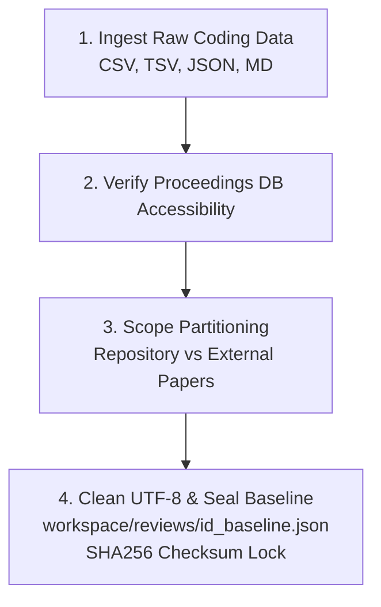

# Skill: ingest-baseline-review

## Purpose & Responsibility
Purely deterministic ingestion of raw human qualitative coding samples, expert matrices, or prior benchmark datasets into an immutable, sealed baseline review. 
This skill guides agents through loading external data, verifying reference accessibility against the repository's SQLite database (`proceedings.db`), partitioning repository papers from external publications, normalizing UTF-8 characters to prevent byte-level corruption (e.g. mojibake), and sealing the baseline with a cryptographic SHA-256 checksum.

> [!NOTE]
> **Strict Separation of Concerns**: This skill does NOT perform AI agentic qualitative analysis, regex extraction, or comparison metrics. Its sole responsibility is deterministic baseline ingestion, database verification, and baseline data freezing.

---

## The 4-Step Ingestion & Sealing Workflow



### Step 1: Ingest Raw Coding Data
- **Supported Formats**: CSV, TSV, JSON, or Markdown tables (e.g. published review tables, expert coding matrices, spreadsheets).
- **Extracted Fields**:
  - Paper bibliographic identifiers: Title, publication year, conference/journal venue, author names, DOI, or handle URL.
  - Qualitative coding columns: Category labels, multi-label checkmarks (`✓`, `?`, blank), and original human notes/explanations.
- **Data Cleanliness & Encoding**:
  - Normalize all checkmark indicators to clean UTF-8 `✓` (`\u2713`), question marks `?`, or empty strings.
  - Strictly prevent byte-level encoding corruption (e.g. `'â\x9c\x93'` mojibake).

### Step 2: Verify Proceedings Database Accessibility
- **Paper Matching**:
  - Match each paper against SQLite `proceedings.db` using:
    1. Handle URL or DOI exact match.
    2. Normalized title string matching:
       ```sql
       SELECT id, title, citation, year, conference, doi, handle_url 
       FROM papers 
       WHERE lower(title) = lower(:normalized_title)
          OR handle_url = :handle_url 
          OR doi = :doi;
       ```
- **Canonical Section Accessibility**:
  - Verify that each matched paper has readable canonical sections in the `sections` table:
    ```sql
    SELECT count(*), sum(length(text)) 
    FROM sections 
    WHERE paper_id = :paper_id;
    ```
  - Confirm non-zero section text length.

### Step 3: Scope Partitioning
Divide the sample into two explicit subsets:
1. **Repository Papers**:
   - Indexed in `proceedings.db` with complete canonical section prose.
   - Flagged for subsequent agentic in-context evaluation.
2. **External / Non-Repository Papers**:
   - Journal publications (e.g. JLS, IJCSCL), non-ISLS conferences (e.g. RESPECT), or non-indexed proceedings.
   - Flagged explicitly as `External / Non-Repository`.
   - Human codes and metadata are preserved as-is, but excluded from agentic LLM analysis.

### Step 4: Clean UTF-8 & Seal Baseline Review
- **Output Target**: Save strictly inside `workspace/reviews/<review_id>_baseline.json`.
- **Review Name Standard**: Must follow the convention:
  `'Baseline Review - <topic/author>'`
- **Schema Requirements**:
  - Every paper must preserve `authors`, `title`, `year`, `conference`, `doi`, `handle_url`, and the original human coding columns.
  - Author listing must be grounded directly in database records.
- **SHA-256 Checksum Sealing**:
  - Compute the SHA-256 checksum of the baseline JSON file:
    ```bash
    shasum -a 256 workspace/reviews/<review_id>_baseline.json
    ```
  - Record the checksum in the file metadata and log it.
  - MANDATE: The baseline file represents immutable ground truth. Once sealed, it must **NEVER be modified, updated, or overwritten** by any subsequent agentic review.

---

## Common Commands & Verification

```bash
# Verify baseline file existence and integrity
python3 -c "
import json, hashlib
with open('workspace/reviews/<review_id>_baseline.json', 'rb') as f:
    data = f.read()
    digest = hashlib.sha256(data).hexdigest()
    print('Baseline papers:', len(json.loads(data).get('papers', [])))
    print('SHA256 Seal:', digest)
"

# Build viewer cache to preview baseline review in Web Viewer
python3 scripts/build_all_reviews_cache.py
```
